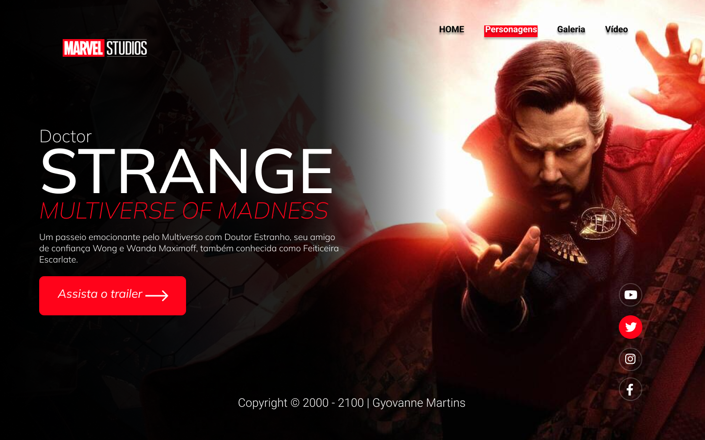

# marvel Stranger
Projeto construido durante as aulas de LIMA, no curso de desenvolvimento de sistemas no[SENAI Jandira](https://jandira.sp.senai.br/), com orientação do Prof. [Fernando Leonid](https://github.com/fernandoleonid)

***

## Qual era p pbjetivo do projeto?
O objetivo era criar uma landing page com base no design feito no figma, aprendendo a estrutura do HTML, CSS, JS e conceitos de responsividade.

***
## O que é uma lading Page?
Lading Page são páginas com foco principal na conversão de visitantes, assim, essas páginas possuem uma estética mais minimalista comparada com os sites tradicionais.

***
## Tecnologias usadas
- HTML 5
- CSS 3
- JavaScript(js)
- Figma

***
## Links 
 - [Veja o resultado do site !!!](https://gyovannems.github.io/marvel--projeto/)

- [Compare com o design](https://www.figma.com/file/hVUdFGJJ1ETpBDtRLm6BH8/LIMA---STRANGER2?node-id=10%3A46)

- [Código](https://github.com/GyovanneMS/marvel--projeto)

***
## Autor
Olá, eu sou o Gyovanne Martins e estou aprendendo sobre programação no SENAI Jandira!! Quer saber mais sobre mim, [clique aqui]().